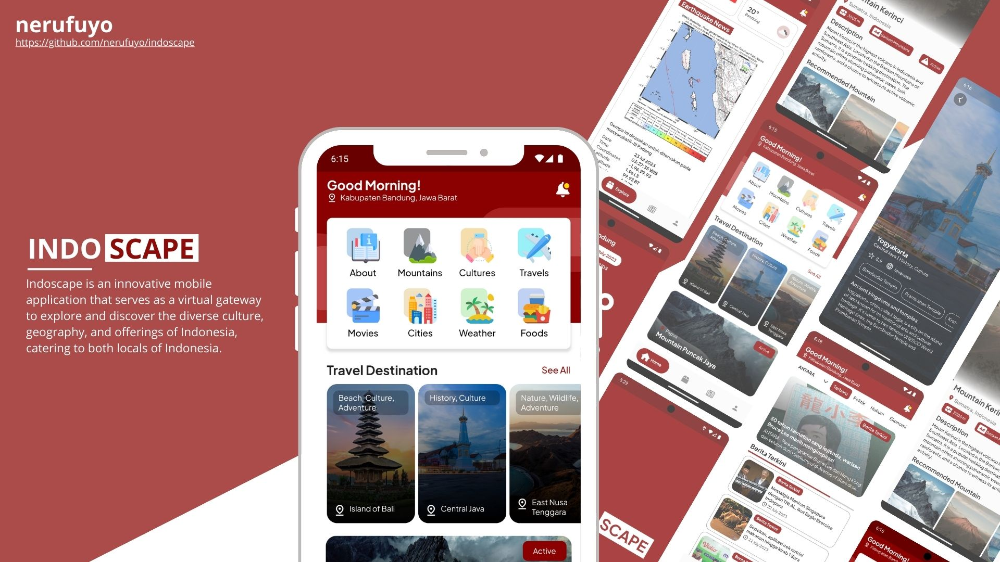

# indoscape

Indoscape is an innovative mobile application that serves as a virtual gateway to explore and discover the diverse culture, geography, and offerings of Indonesia, catering to both locals and international travelers seeking a convenient and engaging way to learn about the country's unique characteristics and stay updated with the latest information.

## Features

- Explore Indonesia's 34 provinces and 514 cities and regencies
- Discover the country's diverse culture, geography, and offerings
- Stay updated with the latest information
- Available in English
- Weather forecast
- News feed
- Travel guide

## Screenshots

